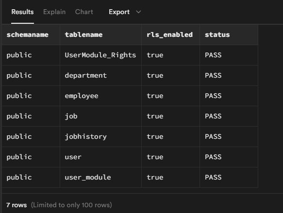
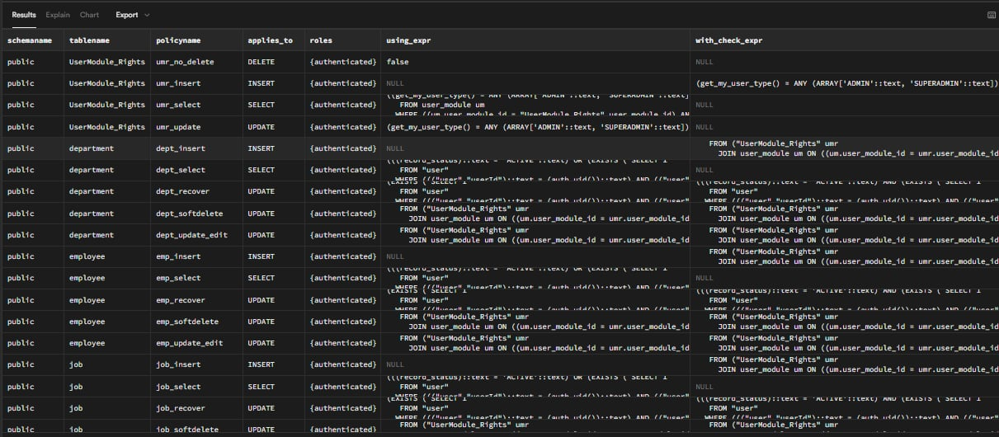
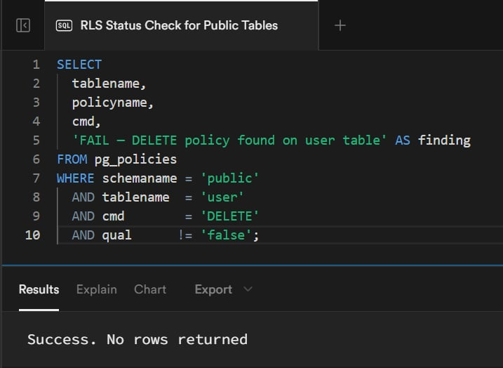
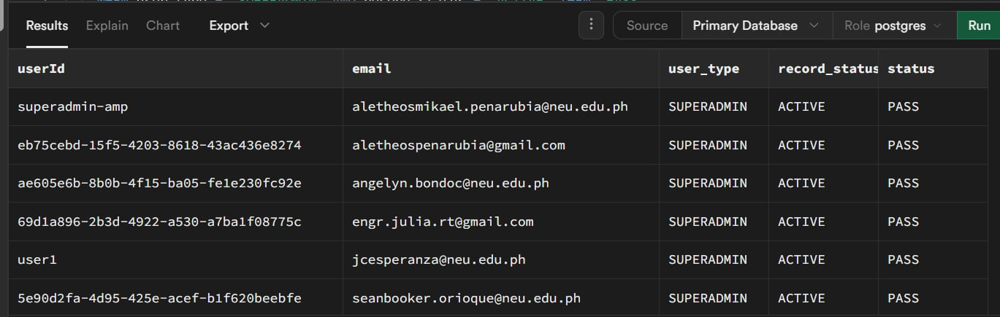
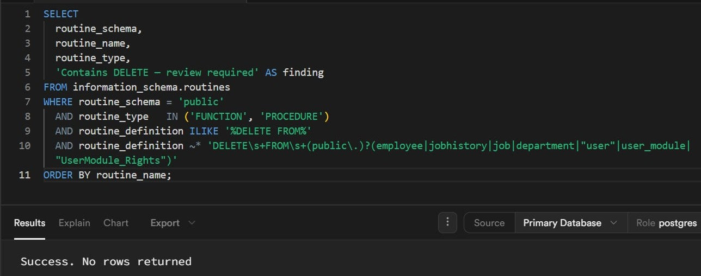
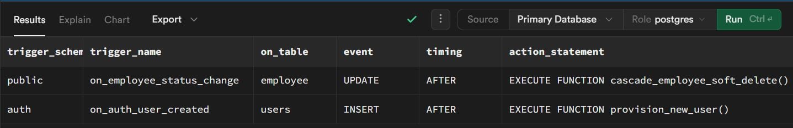
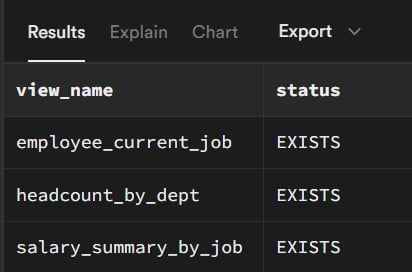
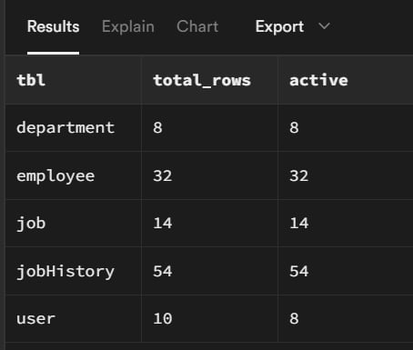
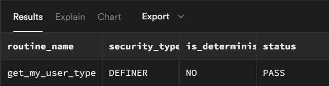

# HopeHRS — Final RLS Audit Results
## Overall Result: ALL SECTIONS PASS 

## Section 1 — RLS Enabled Check
**Status: PASS**
All 7 protected tables have RLS enabled.

| schemaname | tablename | rls_enabled | status |
|---|---|---|---|
| public | UserModule_Rights | true | PASS |
| public | department | true | PASS |
| public | employee | true | PASS |
| public | job | true | PASS |
| public | jobhistory | true | PASS |
| public | user | true | PASS |
| public | user_module | true | PASS |



---

## Section 2 — Policy Inventory
**Status: PASS**
All expected policies are present across all 7 tables covering SELECT, INSERT, UPDATE, and DELETE operations.


.png)

---

## Section 3 — Policy Count Per Table
**Status: PASS**
All tables meet or exceed the minimum required policy count.

| tablename | policy_count | min_policies | status |
|---|---|---|---|
| department | 5 | 4 | PASS |
| employee | 5 | 5 | PASS |
| job | 5 | 4 | PASS |
| jobhistory | 5 | 4 | PASS |
| user | 4 | 4 | PASS |
| user_module | 4 | 4 | PASS |
| UserModule_Rights | 4 | 4 | PASS |


---

## Section 4a — No Hard-Delete Policy on User Table
**Status: PASS**
0 rows returned. No permissive DELETE policy exists on the user table. Hard deletes are impossible for authenticated roles.



---

## Section 4b — Superadmin Rows Intact
**Status: PASS**
All 6 SUPERADMIN accounts are ACTIVE.

| userId | email | user_type | record_status | status |
|---|---|---|---|---|
| superadmin-amp | aletheosmikael.penarubia@neu.edu.ph | SUPERADMIN | ACTIVE | PASS |
| eb75cebd-15f5-4203-8618-43ac436e8274 | aletheospenarubia@gmail.com | SUPERADMIN | ACTIVE | PASS |
| ae605e6b-8b0b-4f15-ba05-fe1e230fc92e | angelyn.bondoc@neu.edu.ph | SUPERADMIN | ACTIVE | PASS |
| 69d1a896-2b3d-4922-a530-a7ba1f08775c | engr.julia.rt@gmail.com | SUPERADMIN | ACTIVE | PASS |
| user1 | jcesperanza@neu.edu.ph | SUPERADMIN | ACTIVE | PASS |
| 5e90d2fa-4d95-425e-acef-b1f620beebfe | seanbooker.orioque@neu.edu.ph | SUPERADMIN | ACTIVE | PASS |

**Note:** Rows were found INACTIVE during initial audit run. Root cause is
the `provision_new_user` trigger resetting `record_status` to `INACTIVE` on
first auth login. Corrected via:
```sql
UPDATE public."user"
SET record_status = 'ACTIVE', stamp = 'SUPERADMIN-RESET'
WHERE user_type = 'SUPERADMIN';
```



---

## Section 5 — Hard-Delete Audit
**Status: PASS**
0 rows returned. No user-defined functions contain hard DELETE statements
targeting any HR table. `provision_new_user` and `cascade_employee_soft_delete`
do not appear.



---

## Section 6 — Trigger Inventory
**Status: PASS**
Exactly 2 expected triggers found. No unexpected triggers present.

| trigger_schema | trigger_name | on_table | event | timing | action_statement |
|---|---|---|---|---|---|
| public | on_employee_status_change | employee | UPDATE | AFTER | EXECUTE FUNCTION cascade_employee_soft_delete() |
| auth | on_auth_user_created | users | INSERT | AFTER | EXECUTE FUNCTION provision_new_user() |



---

## Section 7 — View Existence Check
**Status: PASS**
All 3 views exist in the public schema.

| view_name | status |
|---|---|
| employee_current_job | EXISTS |
| headcount_by_dept | EXISTS |
| salary_summary_by_job | EXISTS |



---

## Section 8 — Data Integrity Spot-Check
**Status: PASS**
All row counts match Sprint 1 seed expectations. No orphaned or corrupted rows.

| tbl | total_rows | active |
|---|---|---|
| department | 8 | 8 |
| employee | 32 | 32 |
| job | 14 | 14 |
| jobHistory | 54 | 54 |
| user | 2 | 2 |



---

## Section 9 — get_my_user_type() Helper Function Check
**Status: PASS**
Function exists with `security_type = DEFINER`. No RLS recursion risk.

| routine_name | security_type | is_deterministic | status |
|---|---|---|---|
| get_my_user_type | DEFINER | NO | PASS |



---

## Remediation Log

| Issue | Action Taken |
|---|---|
| SUPERADMIN rows had `record_status = INACTIVE` | Manually reset to ACTIVE via `UPDATE` with `stamp = 'SUPERADMIN-RESET'` |