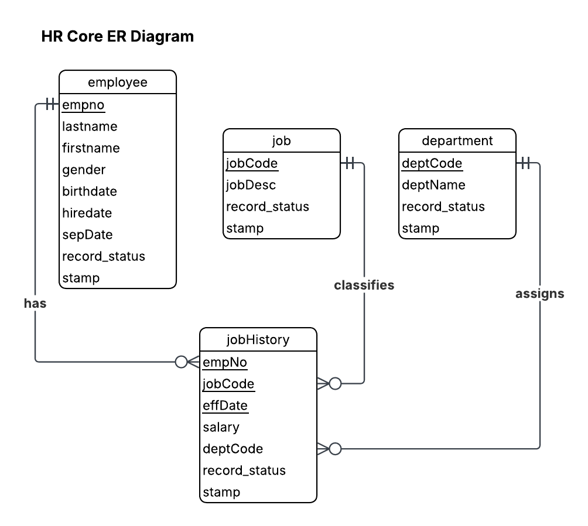
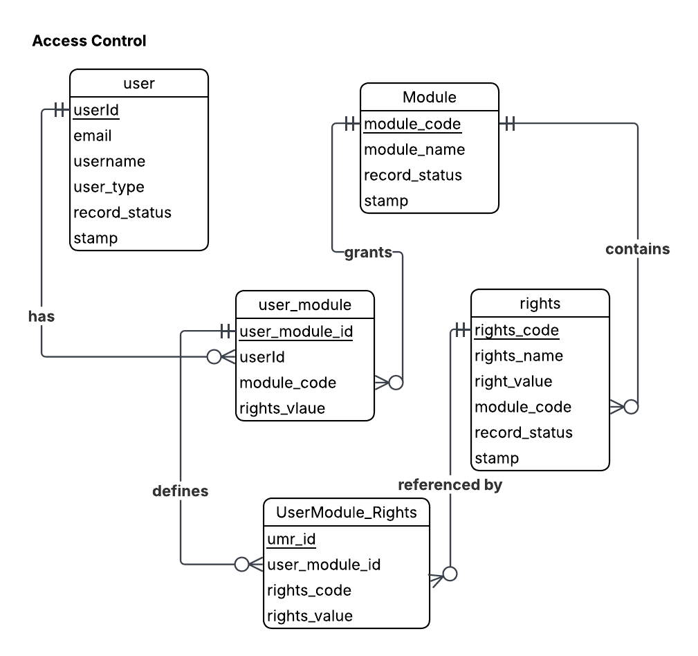

# Entity Relationship Diagram & Schema Notes

## HR ERD

## HR Tables

| Table | Column | Type | Constraint | Notes |
|-------|--------|------|------------|-------|
| **department** | deptCode | VARCHAR(3) | PRIMARY KEY | e.g. ACT, BR1, IT |
| | deptName | VARCHAR(20) | | Full department name |
| | record_status | VARCHAR(10) | DEFAULT 'ACTIVE' | ACTIVE / INACTIVE |
| | stamp | VARCHAR(60) | | Audit trail string |
| **job** | jobCode | VARCHAR(4) | PRIMARY KEY | e.g. PRES, VP, MGR |
| | jobDesc | VARCHAR(20) | | Job description |
| | record_status | VARCHAR(10) | DEFAULT 'ACTIVE' | ACTIVE / INACTIVE |
| | stamp | VARCHAR(60) | | Audit trail string |
| **employee** | empno | VARCHAR(5) | PRIMARY KEY | e.g. 00001 |
| | lastname | VARCHAR(15) | | |
| | firstname | VARCHAR(15) | | |
| | gender | CHAR(1) | CHECK IN ('M','F') | |
| | birthdate | DATE | | |
| | hiredate | DATE | | |
| | sepDate | DATE | NULLABLE | NULL if still employed |
| | record_status | VARCHAR(10) | DEFAULT 'ACTIVE' | ACTIVE / INACTIVE |
| | stamp | VARCHAR(60) | | Audit trail string |
| **jobHistory** | empNo | VARCHAR(5) | PK + FK → employee | |
| | jobCode | VARCHAR(4) | PK + FK → job | |
| | effDate | DATE | PK (composite) | Effective date |
| | salary | DECIMAL(10,2) | CHECK >= 0 | |
| | deptCode | VARCHAR(3) | FK → department | |
| | record_status | VARCHAR(10) | DEFAULT 'ACTIVE' | ACTIVE / INACTIVE |
| | stamp | VARCHAR(60) | | Audit trail string |

---

## Relationships

- `jobHistory.empNo` → `employee.empno`
- `jobHistory.jobCode` → `job.jobCode`
- `jobHistory.deptCode` → `department.deptCode`
- One employee can have many jobHistory rows
- One job can appear in many jobHistory rows
- One department can appear in many jobHistory rows

---
## Access Control ERD

## Rights / Access Control Tables

| Table | Column | Type | Constraint | Notes |
|-------|--------|------|------------|-------|
| **user** | userId | VARCHAR(50) | PRIMARY KEY | |
| | email | VARCHAR(100) | UNIQUE | |
| | username | VARCHAR(50) | | |
| | user_type | VARCHAR(20) | CHECK IN ('SUPERADMIN','ADMIN','USER') | |
| | record_status | VARCHAR(10) | DEFAULT 'INACTIVE' | New users start INACTIVE |
| | stamp | VARCHAR(60) | | Audit trail string |
| **Module** | module_code | VARCHAR(20) | PRIMARY KEY | e.g. Emp_Mod, JH_Mod |
| | module_name | VARCHAR(50) | | |
| | record_status | VARCHAR(10) | DEFAULT 'ACTIVE' | |
| | stamp | VARCHAR(60) | | |
| **user_module** | user_module_id | SERIAL | PRIMARY KEY | |
| | userId | VARCHAR(50) | FK → user | |
| | module_code | VARCHAR(20) | FK → Module | |
| | rights_value | SMALLINT | 0 or 1 | |
| **rights** | rights_code | VARCHAR(30) | PRIMARY KEY | e.g. EMP_VIEW |
| | rights_name | VARCHAR(60) | | |
| | right_value | SMALLINT | 0 or 1 | |
| | module_code | VARCHAR(20) | FK → Module | |
| | record_status | VARCHAR(10) | DEFAULT 'ACTIVE' | |
| | stamp | VARCHAR(60) | | |
| **UserModule_Rights** | umr_id | SERIAL | PRIMARY KEY | |
| | user_module_id | INT | FK → user_module | |
| | rights_code | VARCHAR(30) | FK → rights | |
| | right_value | SMALLINT | 0 or 1 | |

---

## Rights Matrix — 5 Modules × 17 Rights

| Module | Rights Codes | Count |
|--------|-------------|-------|
| Emp_Mod | EMP_VIEW, EMP_ADD, EMP_EDIT, EMP_DEL | 4 |
| JH_Mod | JH_VIEW, JH_ADD, JH_EDIT, JH_DEL | 4 |
| Job_Mod | JOB_VIEW, JOB_ADD, JOB_EDIT, JOB_DEL | 4 |
| Dept_Mod | DEPT_VIEW, DEPT_ADD, DEPT_EDIT, DEPT_DEL | 4 |
| Adm_Mod | ADM_USER | 1 |
| **Total** | | **17** |

---

## User Types & Rights

| Right | SUPERADMIN | ADMIN | USER |
|-------|------------|-------|------|
| EMP_VIEW | YES | YES | YES |
| EMP_ADD | YES | YES | NO |
| EMP_EDIT | YES | YES | NO |
| EMP_DEL | YES | NO | NO |
| JH_VIEW | YES | YES | YES |
| JH_ADD | YES | YES | NO |
| JH_EDIT | YES | YES | NO |
| JH_DEL | YES | NO | NO |
| JOB_VIEW | YES | YES | YES |
| JOB_ADD | YES | YES | NO |
| JOB_EDIT | YES | YES | NO |
| JOB_DEL | YES | NO | NO |
| DEPT_VIEW | YES | YES | YES |
| DEPT_ADD | YES | YES | NO |
| DEPT_EDIT | YES | YES | NO |
| DEPT_DEL | YES | NO | NO |
| ADM_USER | YES | NO | NO |

---

## SUPERADMIN Seed

| Field | Value |
|-------|-------|
| userId | user1 |
| email | jcesperanza@neu.edu.ph |
| username | jcesperanza |
| user_type | SUPERADMIN |
| record_status | ACTIVE |
| stamp | SEEDED |
| right_value | 1 for all 17 rights |

